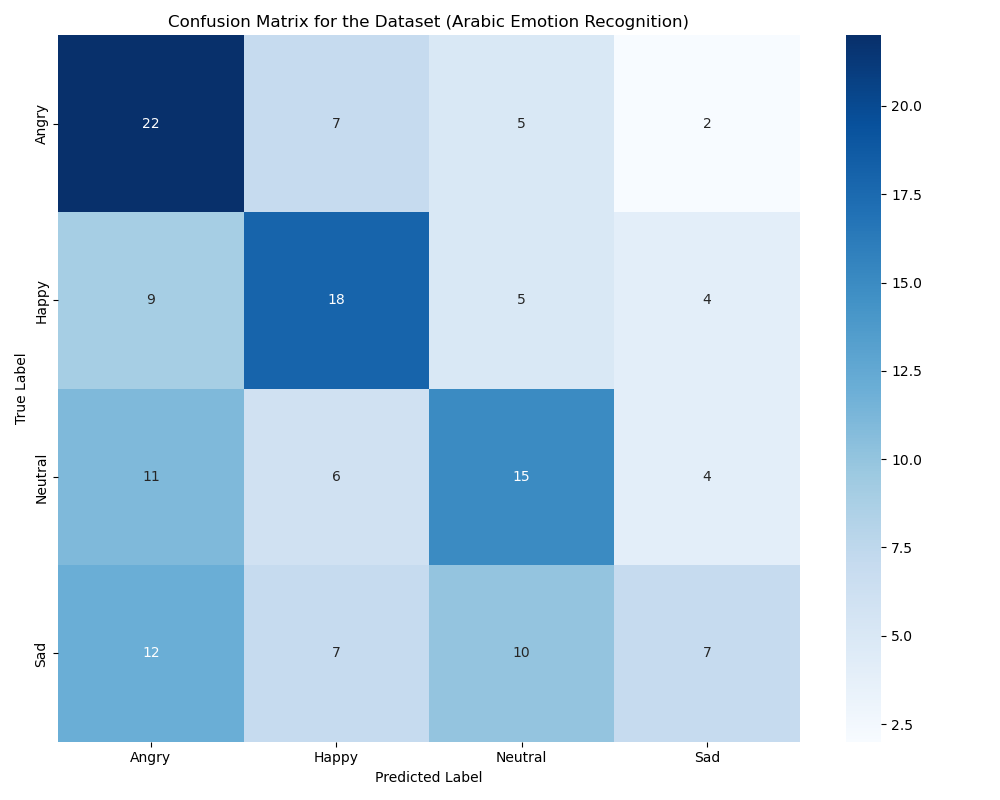

# Arabic Audio Emotion Recognition using ResNet50, SCA, and k-NN

This project implements an emotion recognition system for Arabic audio signals that can detect four distinct emotions: Angry, Happy, Neutral, and Sad. Using a sophisticated pipeline of spectrogram generation, feature extraction with ResNet50, and intelligent feature selection, the system achieves efficient and accurate emotion classification from Arabic speech.

## Summary of Approaches and Results

This section details the various methods explored to improve emotion recognition accuracy.

### Initial Approach: ResNet50 + SCA-KNN
- **Problem**: Fitness function for SCA stagnated around 0.6, even with 200 iterations.
- **Result**: Maximum accuracy achieved was approximately 45%.

### Explored Solutions & Enhancements:

1.  **Equilibrium Optimizer (EO) instead of SCA (with KNN)**:
    *   **Result**: Slightly improved accuracy by ~0.3% to around 47%.
    *   **Observation**: Experienced stagnation after initial improvements in early iterations.

2.  **K-Nearest Neighbors (KNN) with Cosine Similarity (instead of Euclidean)**:
    *   **Result**: 39% accuracy with unscaled data (100 iterations).

3.  **Using F1-score as Fitness Metric (instead of accuracy for feature selection)**:
    *   **Result**: 42% accuracy.

4.  **Sine Cosine Algorithm (SCA) with Random Forest (instead of KNN, with validation split)**:
    *   **Result**: 45% accuracy with unscaled data.

5.  **ResNet Feature Permutation (before splitting and feature selection)**:
    *   **Result**: 39% accuracy.

### Alternative Models & Benchmarks:

-   **Parallel CNN optimising the conv using EO:
    *   **Result**: Accuracy: 80.84%
    *   Details and optimization of convolutional layers. implimentation in ["Parallel cnn eo" folder](https://github.com/amine-dubs/arabic-emotion-recognition-V2/tree/main/Parallel%20cnn%20eo)
    *   *Reference*: [Kaggle - EAED using Parallel CNN Transformer](https://www.kaggle.com/code/mohammedhassanain/eaed-using-parallel-cnn-transformer/notebook)

-   **Wav2Vec2.0**:
    *   **Result**: Achieved 70% accuracy on the EYASE dataset.
    *   *Reference*: [Kaggle - EYASE Wav2Vec2.0](https://www.kaggle.com/code/mohammedhassanain/eyase-wav2vec2-0)

### Potential Future Directions:

-   **Alternative Feature Extractors**:
    *   Experiment with EfficientNet or MobileNet as alternatives to ResNet50.
-   **Optimized Feature Permutation and Selection**:
    *   Further investigate the impact of feature permutation followed by optimization algorithms like EO for feature selection.
-   **Dynamic Threshold for Feature Selection**:
    *   Instead of a fixed 0.5 threshold for binary feature selection, explore a dynamic threshold (e.g., adding an extra parameter to the SCA/EO solution space, making it 2048 features + 1 threshold parameter).

<p align="center">
  

## Project Goal

The primary goal is to classify emotions from Arabic audio recordings by:
1. Transforming audio signals into MEL spectrograms
2. Extracting deep features using a pre-trained ResNet50 model (average pooling layer output)
3. Selecting the most relevant features using the Sine Cosine Algorithm (SCA) from the `mealpy` library
4. Classifying emotions using the k-Nearest Neighbors (k-NN) algorithm with hyperparameter tuning
5. Providing comprehensive evaluation metrics and visualization
6. Delivering a user-friendly web interface for real-time emotion recognition

## Implementation Details

### 1. Dataset
- The implementation uses the **EYASE** dataset with Arabic audio recordings
- The dataset contains 720 audio samples equally distributed across 4 emotions (180 samples per emotion)
- The expected structure inside `Data` is `EYASE/Actor/Emotion/*.wav`
- Audio files are loaded using `librosa`, resampled to 16kHz, and truncated/padded to 3 seconds

### 2. Data Preprocessing & Augmentation
- Audio signals are converted into MEL spectrograms using `librosa.feature.melspectrogram`
- Spectrograms are converted to decibels
- **Data Augmentation**: Noise addition with controlled SNR (Signal-to-Noise Ratio) is applied to balance underrepresented emotion classes

### 3. Feature Extraction
- A pre-trained ResNet50 model (`tensorflow.keras.applications.ResNet50`) with ImageNet weights is used
- Spectrograms are resized to (224, 224), normalized, and converted to 3 channels to match ResNet50 input requirements
- Features are extracted from the global average pooling layer of the ResNet50 model (output shape: 2048 features)
- Features are scaled using `sklearn.preprocessing.StandardScaler` after splitting the data

### 4. Feature Selection
- Utilizes the Sine Cosine Algorithm (`mealpy.swarm_based.SCA.OriginalSCA`)
- **Problem Type:** Binary (select or discard feature)
- **Data Split:** 80% training, 20% test (no separate validation set)
- **Fitness Function:** Minimize `0.99 * (1 - test_accuracy) + 0.01 * (num_selected_features / total_features)`
- SCA is applied to both scaled and unscaled features for comparison, with the better-performing subset used for classification

### 5. Classification
- GridSearchCV is used to find the optimal hyperparameters for the k-NN classifier
- The system automatically reverts to a default model if GridSearchCV produces a model with worse performance
- ROC curves are generated using a custom probability estimation approach for k-NN
- Additional classifiers (RandomForest, MLP) can be compared using the `compare_classifiers.py` script

### 6. Evaluation and Visualization
- Comprehensive performance metrics are generated for both scaled and unscaled feature sets
- Visualizations include confusion matrices, ROC curves, feature importance, and accuracy by emotion
- All evaluation metrics and visualizations are automatically generated and saved

### 7. Web Application
- A Streamlit web application provides an interactive interface for using the trained model
- Users can upload audio files and receive emotion predictions with confidence scores
- The app displays:
  - The detected emotion with confidence scores
  - Visualization of the MEL spectrogram
  - Response recommendations based on the detected emotion
- **Model Management Features**:
  - Display of cache usage status
  - Option to retrain the model with different parameters
  - Comprehensive evaluation metrics with visualizations

## Recent Improvements

- **Fixed Model Selection Issue**: The system now ensures that the final model is always at least as good as the initial model, preventing GridSearchCV from selecting suboptimal parameters
- **ROC Curve Generation**: Implemented custom probability estimation for k-NN to properly generate ROC curves
- **Emotion Alignment**: Fixed issues with emotion label mismatches between training and application
- **Performance Enhancement**: Added capability to compare multiple classifiers (k-NN, Random Forest, MLP) to find the best performer

## Performance

The current system achieves:
- Training accuracy: ~98% 
- Test accuracy: ~43% (with 4 emotion classes)
- Feature selection significantly reduces dimensionality while maintaining performance
- Scaled features generally perform better than unscaled features

<p align="center">
  
</p>

## Dependencies

```
numpy>=1.19.5
pandas>=1.1.5
librosa>=0.8.1
matplotlib>=3.4.3
seaborn>=0.11.2
tensorflow>=2.6.0
scikit-learn>=0.24.2
mealpy>=2.5.0
scikit-image>=0.18.3
streamlit>=1.11.0
joblib>=1.0.1
```

## How to Run

1. **Setup:**
   - Clone the repository: `git clone https://github.com/amine-dubs/arabic-emotion-recognition-V2.git`
   - Install dependencies: `pip install -r requirements.txt`

2. **Training:**
   - Run the main script: `python eaed-using-parallel-cnn-transformer.py`
   - For a clean retrain: `python eaed-using-parallel-cnn-transformer.py --clear-model`
   - To start from scratch: `python eaed-using-parallel-cnn-transformer.py --clear-all`

3. **Web Application:**
   - Launch the web app: `streamlit run app.py`
   - Access the app through your web browser (typically http://localhost:8501)

4. **Evaluation:**
   - View all generated metric files in the project root
   - Use `extract_evaluation_metrics.py` to regenerate any missing evaluation metrics

## Additional Scripts

- `compare_classifiers.py` - Compare performance of multiple classifier algorithms
- `check_class_balance.py` - Verify the emotion distribution in your dataset
- `extract_evaluation_metrics.py` - Generate or regenerate evaluation metrics
- `fix_roc_curves.py` - Fix issues with ROC curve generation for k-NN models
- `clear_cache.py` - Utility to clear cached models and features

## Future Enhancements

- Implement more sophisticated audio data augmentation techniques
- Experiment with different feature extraction models specialized for audio
- Try additional classification algorithms beyond k-NN
- Add support for real-time audio analysis through microphone input
- Expand the language support to detect emotions in other languages

## Contributors

- Amine Belatrache - Main developer

## License

This project is provided for educational and research purposes.
